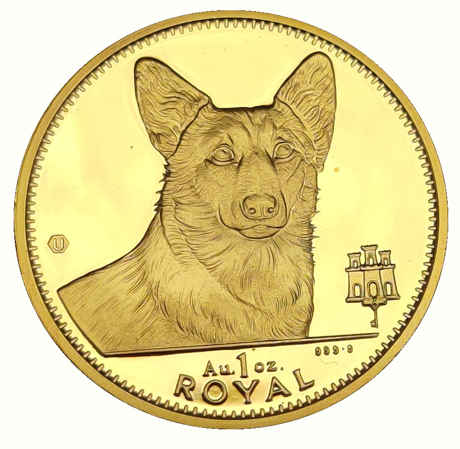
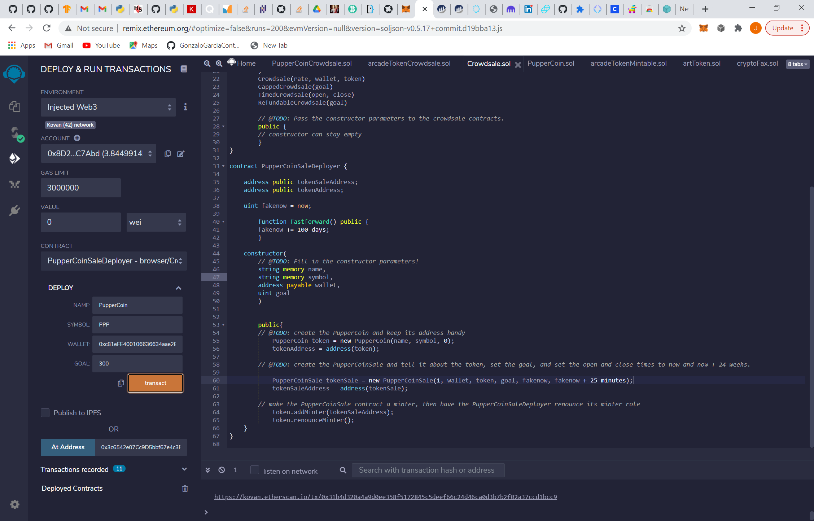
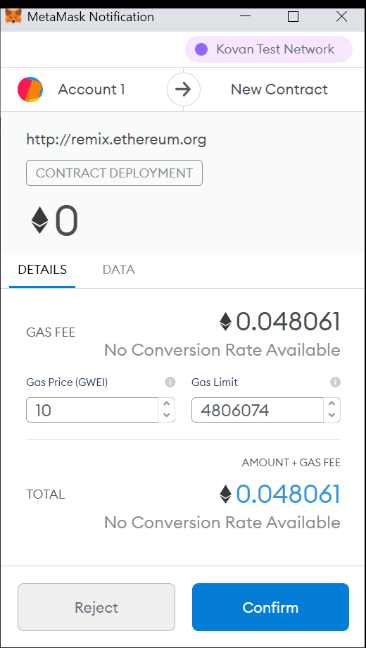
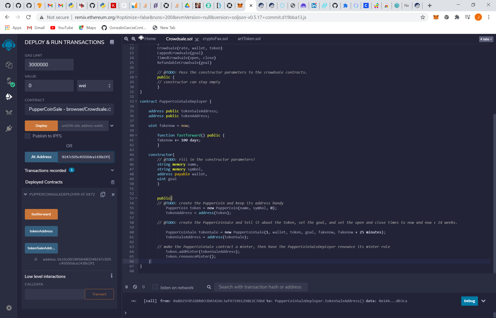
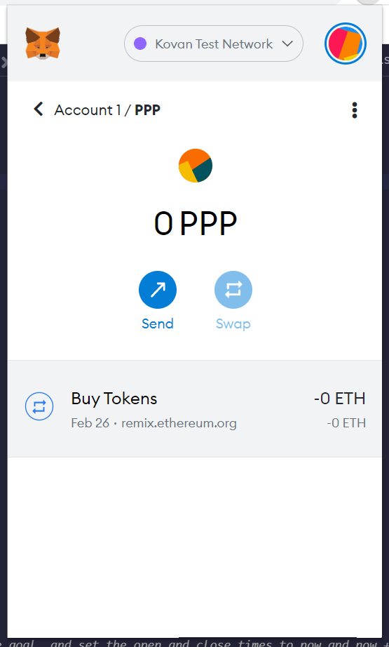
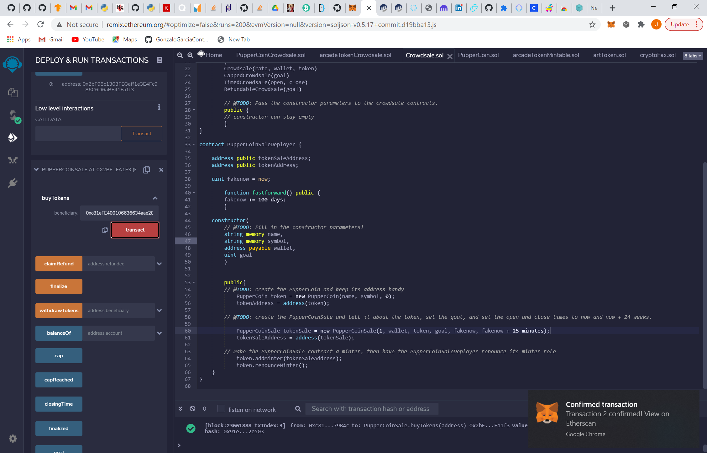
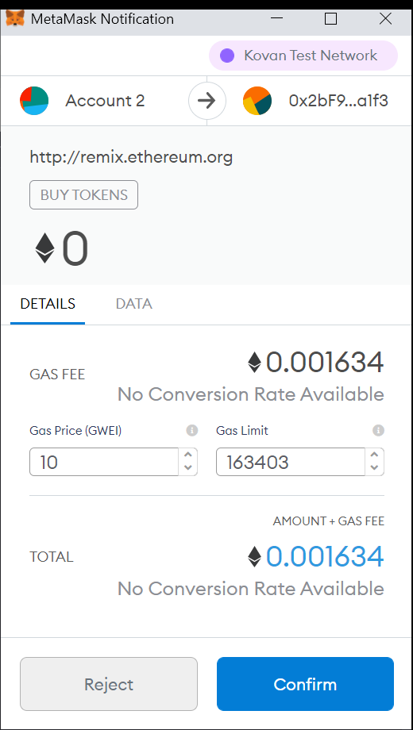
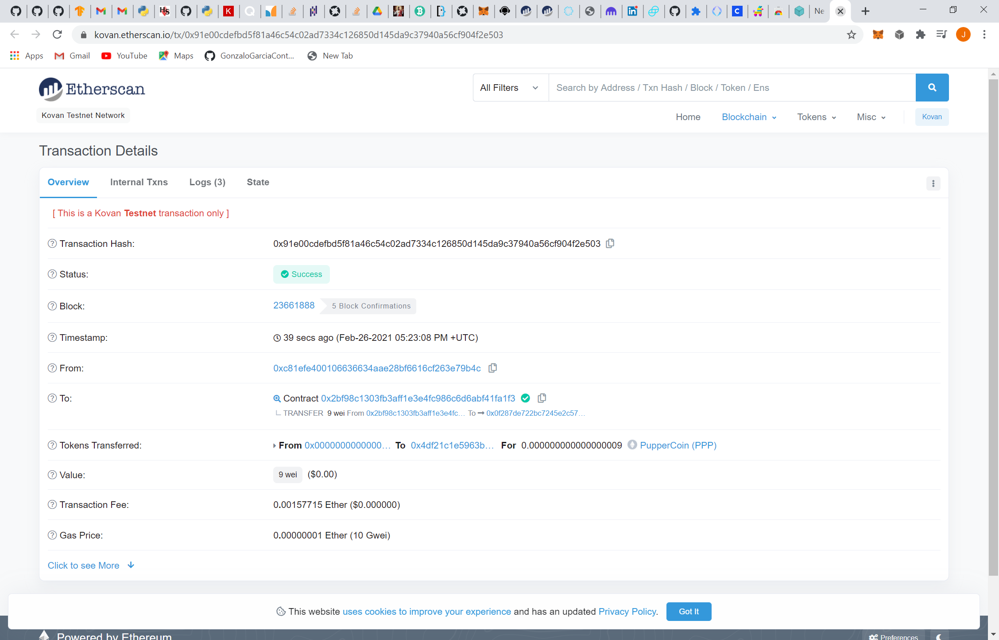

# PupperCoin Crowndsale
It is meant to track the dog breeding activity across the globe in a decentralized way, and allow humans to track the genetic trail of their pets.

## How to Use PupperCoin (PPP)
* PupperCoin has two contracts PupperCoin.sol and Crowdsale.sol and both are needed in order to purchase PPP.
* First,we need to deploy Crowdsale.sol making sure the Environment is in Injected Web3, the contract is in PupperCoinSaleDeployer, filling up the deploy requirements, and click transact.
  
* Then, MetaMask shows the notification asking for confirmation to deploy the contract. 
   
* After deploying, we need to switch the contract to PupperCoinSale, copy the tokenSaleAddress giving by PupperCoinSaleDeployer, paste in At Address, and click At Address.
    
* Once we had the PupperCoinSale contract we add the token PPP to MetaMask. copying the address of PupperCoinSale contract, going to MetaMask and add custom token, paste the address, adding the symbol; so all the transactions will be recorded in MetaMask.
  
* After that step, we have all the functions available in PupperCoinSale contract, so to buy tokens we need the address which is buying the tokens, add the amount to buy in VALUE cell and click transact in buyTokens.
  
* Then, MetaMask shows the notification asking for confirmation to buy tokens with the details of the transaction gas.
    
* Through kovan.etherscan we can see the transaction details such as transaction hash.
  